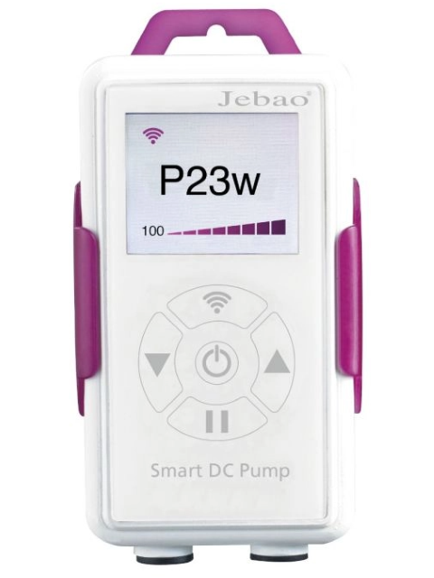

# Home Assistant Custom Integration: Jebao Aquarium Pumps

This custom integration for Home Assistant allows users to control and monitor certain models of Wi-Fi enabled Jebao Aquarium Wavemakers/Pumps. Currently tested with the M series devices (with white and purple controller), though in theory it should be possible to get working with any device that supports Wi-Fi and makes use of the "Jebao Aqua" app for control.

The integration currently polls devices via the LAN for status updates but uses the Gizwits Cloud API for remote control.

_Note: I'm not a developer. This code was almost entirely written by ChatGPT based on my packet captures, the Gizwits documentation and some resources from the mobile app APK. I now realise it doesn't conform to established practices for Home Assistant to directly interface with the API from an integration, but it does work!_

## Compatibility

| Device Model            | Compatibility  |
|-------------------------|----------------|
| Jebao MCP Series Crossflow Wavemaker | ✅ Tested and working |
| Jebao MLW Series Wavemaker      | ✅ Tested and working |
| Jebao SLW Series Wavemaker      | ⚠️ Added but not confirmed working |
| Jebao EP Series Pumps | ⚠️ Added but not confirmed working - see: [This issue for some notes ](https://github.com/chrisc123/jebao_aqua-homeassistant/issues/) |
| Other Jeabo Pumps | Not tested |

## Background
* The pump control unit houses an Espressif ESP8266 microcontroller, this is running a version of the [Gizwits GAgent](https://docs.gizwits.com/en-us/DeviceDev/GAgent.html#Features) code.
* Both the mobile app and pumps appear to communicate exclusively with Gizwits cloud - there is no indication of any Jebao specific infrastructure in use.
* Gizwits is, apparently, "The largest IoT development platform in Asia" - The [Bestway/Lay-Z-Spa](https://github.com/cdpuk/ha-bestway) and [PH-803W pH Controller](https://github.com/dala318/python_ph803w) projects are a examples of other Home Assistant integrations that interact with Gizwits platform via cloud and local methods, respectively. 
* TODO - To devices appear to use some form of unencrypted MQTT between device and cloud - have a feeling it _might_ be possible to reconfigure the devices to point to arbitrary MQTT server instead (as part of the onboarding process involves binding the devices to the appropriate regional (EU/US/Asia?) Gizwits cloud).
* Explain 'bindings', 'datapoint', 'devdata' and 'control' API endpoints. 
* Local interface on TCP/12416 - cloud helpfully provides payload structure
  

## Why?
Although these pumps are fairly quiet, I wanted integration with Home Assistant to be able to easily turn the flow rate (and consequently noise) down in certain circumstances. The fact we can also monitor for fault conditions on the pumps is also helpful. 

## Features

- Control Jebao Aquarium Pumps remotely via the Gizwits API.
- Poll device status locally for real-time updates (primarily so that we don't annoy Gizwits with excessive requests, but also provides faster response to control commands).
- Supports various entities like switches, sensors, selectors, and numeric inputs for comprehensive control.
- Does not support the native 'scheduling' features that the app has - just use HA instead.

TODO:
- LAN IP Auto discovery - this is easy to do at a protocol level, just need to figure out how to get a Home Assistant integration to listen for UDP packets on a given port.
- Local Control - In theory it would be more robust to avoid interacting with the Gizwits API at all. Currently we use the local interface for _polling_ but not for _control_. Need to check: https://github.com/tancou/jebao-dosing-pump-md-4.4 and associated https://github.com/Apollon77/node-ph803w as now realise they have already done this...

## Installation

### Manual Installation

1. The pumps must already be setup with the Jebao Aqua app and connected to a Wi-Fi network that is routable from your Home Assistant installation.
2. Note down the local IP addresses of your pumps using the app (from the individual pump control interface enter the "Settings" menu via icon in top right, then view "Device Information")
3. Use HACS or clone the repo locally to install the integration code to /custom_components/
4. Review const.py - if you're based in the US you'll likely need to update the URLs to be usaepapp.gizwits.com / usapi.gizwits.com rather than euaepapp.gizwits.com and euapi.gizwits.com.
5. Add the "Jebao Aqua Aquarium Pump" integration via Home Assistant integrations dashboard, you'll be prompted to enter the login details for the Jebao Aqua app. The integration should then discover the devices linked to your account and ask you to provide the local IP for each. 

### Configuration

TODO - Explain how to create the JSON file for your specific pump model (is this necessary. need to test with more models!), explain how the JSON for each pump model needs to be obtained from Gizwits '/app/datapoint' endpoint and which Chinese strings need to be translated. Or perhaps we can just bulk download these - we do know what the app tries to check...

## Usage

Once installed and configured, the integration allows you to:

- Turn pumps on and off.
- Adjust flow, frequency settings, mode. 
- Monitor status and any fault indicators.

## Troubleshooting

If you encounter issues, enable Debug logging, and check the Home Assistant logs. You can also raise an issue in this repository.

