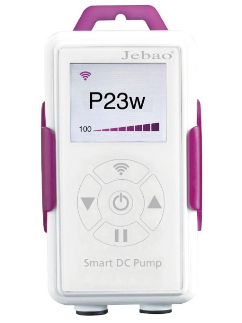

# Jebao Aqua Aquarium Pump - Home Assistant Integration

[](https://github.com/hacs/integration)
[](https://github.com/chrisc123/jebao_aqua-homeassistant/releases)
[](LICENSE)

Control and monitor Wi-Fi enabled Jebao Aquarium Wavemakers and Pumps directly from Home Assistant. This custom integration provides local polling for status updates and cloud-based control via the Gizwits API.



## ✨ Features

- **Local Status Polling** - Fast, local LAN polling for real-time device status updates
- **Cloud Control** - Reliable control commands via Gizwits cloud API
- **Automatic Discovery** - Automatic detection of devices on your local network
- **Comprehensive Control** - Switches, sensors, number inputs, and select entities for full device control
- **Multi-Region Support** - Works with EU, US, and CN Gizwits servers
- **Fault Monitoring** - Binary sensors for device fault detection and alerting
- **Native HA Integration** - Proper config flow setup with options flow for reconfiguration

### Available Entities

| Entity Type | Description | Examples |
|------------|-------------|-----------|
| **Switch** | Power control | Turn pump on/off, enable/disable modes |
| **Binary Sensor** | Fault detection | Motor fault, communication errors |
| **Number** | Numeric controls | Flow rate (0-100%), Wave frequency |
| **Select** | Mode selection | Operating modes, schedules |

## 🔧 Compatibility

> [!IMPORTANT]
> As of late 2024, some Jebao devices ship with newer hardware that includes Bluetooth (BLE) support in addition to WiFi, using an ESP32C3 microcontroller. **These WiFi+BLE devices are not yet supported** but compatibility is under investigation.

| Device Model | WiFi Only | WiFi+BLE | Status |
|--------------|-----------|----------|--------|
| Jebao MCP Series Crossflow Wavemaker | ✅ | ❌ | Tested and working |
| Jebao MLW Series Wavemaker | ✅ | ❌ | Tested and working |
| Jebao SLW Series Wavemaker | ⚠️ | ❌ | Added but not confirmed |
| Jebao EP Series Pump | ⚠️ | ❌ | Added but not confirmed |
| Jebao Smart Doser 3.1 | ✅ | ❌ | Added by @jeffcybulski |
| Jebao MD 4.4 Dosing Pump | ✅ | ❌ | Added by @jeffcybulski |
| Jebao MD 2.4 Dosing Pump | ✅ | ❌ | Added by @joluan01 |

### How to Check Your Device

WiFi-only devices use an **ESP8266** microcontroller and work with this integration. WiFi+BLE devices use an **ESP32C3** and are not yet supported.

## 📋 Requirements

- Home Assistant 2024.1.0 or newer
- Jebao Aqua app account with registered devices
- Devices connected to the same network as Home Assistant (recommended for local polling)
- Python 3.11 or newer

## 📥 Installation

### HACS (Recommended)

1. Ensure [HACS](https://hacs.xyz/) is installed
2. Go to **HACS** → **Integrations**
3. Click the **+** button and search for **"Jebao Aqua"**
4. Click **Download**
5. Restart Home Assistant
6. Continue to [Configuration](#-configuration)

### Manual Installation

1. Download the [latest release](https://github.com/chrisc123/jebao_aqua-homeassistant/releases)
2. Extract and copy the `custom_components/jebao_aqua` folder to your Home Assistant `config/custom_components/` directory
3. Restart Home Assistant
4. Continue to [Configuration](#-configuration)

## ⚙️ Configuration

### Initial Setup

1. Go to **Settings** → **Devices & Services**
2. Click **Add Integration** and search for **"Jebao Aqua Aquarium Pump"**
3. Select your **Country** from the dropdown (this determines which Gizwits regional server to use)
4. Enter your **Jebao Aqua app credentials**:
   - Email address
   - Password
5. Click **Submit**

The integration will:
- Automatically discover devices on your local network (5 second timeout)
- Retrieve your registered devices from the Gizwits cloud
- Match discovered devices with your cloud account

### Device Configuration

After authentication, you'll see a list of your devices:

- **Discovered devices** will show their local IP address automatically
- **Cloud-only devices** can be left empty or you can manually enter the IP address

**Local IP Benefits:**
- Faster status updates (2 second polling interval)
- Reduced cloud API calls
- Works when internet connectivity is degraded

**Cloud-only Mode:**
- Uses Gizwits cloud for both status and control
- Slower updates
- Requires internet connectivity

> [!TIP]
> You can find device IP addresses in the Jebao Aqua app:
> Device screen → Settings (top right) → Device Information

### Reconfiguration

To update credentials or device IP addresses:

1. Go to **Settings** → **Devices & Services**
2. Find **Jebao Aqua Aquarium Pump** and click **Configure**
3. Select **Update credentials and rediscover devices**
4. Follow the setup flow again

## 🏗️ Technical Details

### Architecture

This integration uses a hybrid approach:
- **Status Updates**: Local LAN polling via TCP port 12416 (Gizwits GAgent protocol)
- **Control Commands**: Cloud API calls to Gizwits servers (more reliable than local control)

### Gizwits Platform

Jebao devices use the [Gizwits IoT platform](https://www.gizwits.com/), one of the largest IoT platforms in Asia. The pump controller contains an ESP8266 running the Gizwits GAgent firmware.

Other Home Assistant integrations using Gizwits:
- [Bestway/Lay-Z-Spa](https://github.com/cdpuk/ha-bestway)
- [PH-803W pH Controller](https://github.com/dala318/python_ph803w)

### Device Models

Each device type requires a JSON model file in `custom_components/jebao_aqua/models/` that defines:
- Available attributes (switches, numbers, selects)
- Data types and ranges
- Binary protocol positions and bit offsets

Model files are automatically loaded on startup.

## 🎯 Use Cases

### Automation Examples

**Reduce noise during movie time:**
```yaml
automation:
  - alias: "Quiet Aquarium During Movies"
    trigger:
      - platform: state
        entity_id: media_player.living_room_tv
        to: "playing"
    action:
      - service: number.set_value
        target:
          entity_id: number.jebao_mcp_flow_rate
        data:
          value: 30  # Reduce to 30%
```

**Alert on pump fault:**
```yaml
automation:
  - alias: "Aquarium Pump Fault Alert"
    trigger:
      - platform: state
        entity_id: binary_sensor.jebao_mcp_motor_fault
        to: "on"
    action:
      - service: notify.mobile_app
        data:
          title: "Aquarium Alert"
          message: "Pump motor fault detected!"
          data:
            priority: high
```

**Schedule feeding mode:**
```yaml
automation:
  - alias: "Feeding Time"
    trigger:
      - platform: time
        at: "09:00:00"
    action:
      - service: select.select_option
        target:
          entity_id: select.jebao_mcp_mode
        data:
          option: "Feeding"
      - delay: "00:10:00"
      - service: select.select_option
        target:
          entity_id: select.jebao_mcp_mode
        data:
          option: "Constant"
```

## 🐛 Troubleshooting

### Devices Not Discovered

If automatic discovery fails:
1. Ensure devices are on the same subnet as Home Assistant
2. Check that UDP broadcasts are not blocked by your router
3. Manually enter device IP addresses during setup
4. Verify devices are registered in the Jebao Aqua app

### Connection Issues

**Device Unavailable:**
- Check device is powered on and connected to WiFi
- Verify IP address hasn't changed (consider setting static IP/DHCP reservation)
- Check firewall rules allow TCP port 12416

**Authentication Failed:**
- Verify credentials in Jebao Aqua app still work
- Check you selected the correct region/country
- Try reconfiguring the integration

### Enable Debug Logging

Add to `configuration.yaml`:
```yaml
logger:
  default: info
  logs:
    custom_components.jebao_aqua: debug
```

Then check **Settings** → **System** → **Logs** for detailed information.

### Known Issues

- WiFi+BLE devices (ESP32C3) not supported yet
- Native scheduling features from Jebao app not exposed (use HA automations instead)
- First status update may take 2-5 seconds after control command

## 🚀 Future Enhancements

- [ ] Local control commands (avoid cloud dependency)
- [ ] Support for WiFi+BLE devices (ESP32C3)
- [ ] Improved UDP discovery with listener service
- [ ] Diagnostic sensors for device statistics
- [ ] Service calls for advanced features
- [ ] Configuration flow improvements for bulk IP entry

## 🤝 Contributing

Contributions are welcome! Areas that need help:
- Testing with untested device models
- Support for new device types
- Protocol reverse engineering for ESP32C3 devices
- Improved error handling and recovery
- Documentation improvements

## 📄 License

This project is licensed under the MIT License - see [LICENSE](LICENSE) for details.

## 🙏 Credits

- Created by [@chrisc123](https://github.com/chrisc123)
- Significant contributions from [@jeffcybulski](https://github.com/jeffcybulski) (Doser support)
- Contributions from [@joluan01](https://github.com/joluan01) (MD 2.4 support)
- Built with assistance from ChatGPT for protocol reverse engineering

## ⚠️ Disclaimer

This integration is not affiliated with, endorsed by, or supported by Jebao or Gizwits. Use at your own risk.

---

**Found this useful?** Please ⭐ star this repo and consider [reporting issues](https://github.com/chrisc123/jebao_aqua-homeassistant/issues) or contributing!
